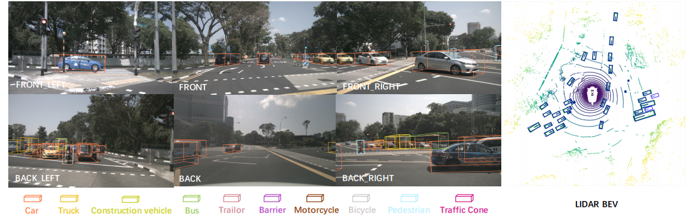

# Simple Perception for Autonomous Driving


Are you tired of struggling to understand complex and messy codebase of perception algorithms? Are you frustrated by the overwhelming amount of dependencies and large datasets required just to get started? Have you ever felt lost trying to use a piece of code in a perception model?

**Simple-perception** is the solution you've been searching for. This repository offers a streamlined and straightforward implementation of various perception algorithms, specifically tailored for AV applications. 

Whether you're a beginner or an experienced researcher, whether you want to learn a SOTA algorithm fast or quickly find the correct piece of code to
integrate to your own pipeline, Simple-perception is an excellent choice.

## Features
- [x] Reorganize the SOTA AV perception algorithms in a streamlined and straightfoward way
- [x] No complicated class inheritance, datasetclass,nor runner/hooking, just pure algorithm. 
- [x] Only pytorch is required. You don't even need a gpu.
- [x] No need to download any dataset to run a model. Simple mocked data is used
- [x] Very detailed comments for each line of code to help understand SOTA better

## Table of Contents (more are coming!)
- 3D camera object detection
  - [BEVFormer(ECCV2022)](https://arxiv.org/abs/2203.17270)
    
- 3D LiDAR detection
  - [PointNet++(NIPs2017)](https://arxiv.org/abs/1706.02413)
    
## Installation
To install via pypi:
```commandline
pip install simple-perception
```
To install locally:
```commandline
git clone https://github.com/DerrickXuNu/simple_perception
cd simple_perception
pip install .
```

## Usage
```python
import torch
from simple_perception.camera_only.bevformer.bevformer_tiny.bevformer import BEVFormer
from simple_perception.camera_only.bevformer.bevformer_tiny.config import bevformer_config
from simple_perception.camera_only.bevformer.bevformer_tiny.mocked_img_meta import img_metas 

batch_size = 1
n_gt = 32
len_queue = 3
num_camera = 6

data_dict = {
    'img_metas': [img_metas * len_queue] * batch_size,
    'img': torch.rand(batch_size, len_queue, num_camera, 3, 480, 800),
    'gt_bboxes_3d': [torch.rand(n_gt, 9)] * batch_size,
    'gt_labels_3d': [torch.randint(0, 10, (n_gt,))] * batch_size
}

bevformer = BEVFormer(**bevformer_config)
loss = bevformer(train=True, **data_dict)
output = bevformer(train=False, **data_dict)

```
## Acknoledgement
Most of the codes are from the official implementations, and I re-organize them in a easy-to-understand manner. The demo figure is from the paper [DeepInteraction](https://arxiv.org/pdf/2208.11112v2.pdf).
## Citations
```shell
@article{li2022bevformer,
  title={BEVFormer: Learning Bird’s-Eye-View Representation from Multi-Camera Images via Spatiotemporal Transformers},
  author={Li, Zhiqi and Wang, Wenhai and Li, Hongyang and Xie, Enze and Sima, Chonghao and Lu, Tong and Qiao, Yu and Dai, Jifeng}
  journal={arXiv preprint arXiv:2203.17270},
  year={2022}
}
```

```shell
  @article{qi2017pointnetplusplus,
    title={PointNet++: Deep Hierarchical Feature Learning on Point Sets in a Metric Space},
    author={Qi, Charles R and Yi, Li and Su, Hao and Guibas, Leonidas J},
    journal={arXiv preprint arXiv:1706.02413},
    year={2017}
  }
```